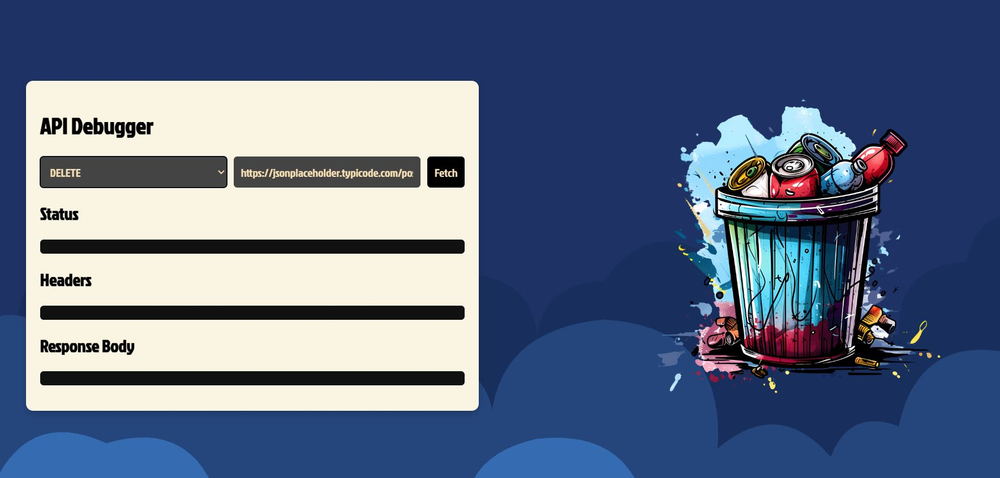

# API Debugger 🔍

A lightweight, user-friendly tool for testing and debugging API endpoints with a clean visual interface.



## Features

- Support for all major HTTP methods: GET, POST, PUT, DELETE
- Clean, intuitive UI with a dark theme
- JSON request body editor for POST and PUT requests
- Detailed response information:
  - Status code and message
  - Response headers
  - Formatted JSON output
  - Image preview for image responses
- Fun, method-specific illustrations that make API testing less boring

## How to Use

1. Select your desired HTTP method from the dropdown
2. Enter the API URL you want to test
3. For POST/PUT requests, enter your JSON payload in the request body
4. Click "Fetch" to send the request
5. View the response details in the status, headers, and body sections

## Try It Out

The tool comes with a default endpoint (`https://jsonplaceholder.typicode.com/posts/1`) so you can test it immediately after loading.

## Technologies Used

- Vanilla JavaScript
- HTML/CSS
- Custom SVG background
- Google Fonts (Jockey One)

## Installation

Simply clone this repository and open `index.html` in your browser:

```bash
git clone https://github.com/pragmaticdev798/apidebugger.git
cd apidebugger
# Open index.html in your browser
```

## Future Improvements

- OAuth support
- Custom headers editor
- Request history
- Response time metrics
- Export/import functionality

## License

MIT

---

Made with ☕ by [pragmaticdev798](https://github.com/pragmaticdev798)
